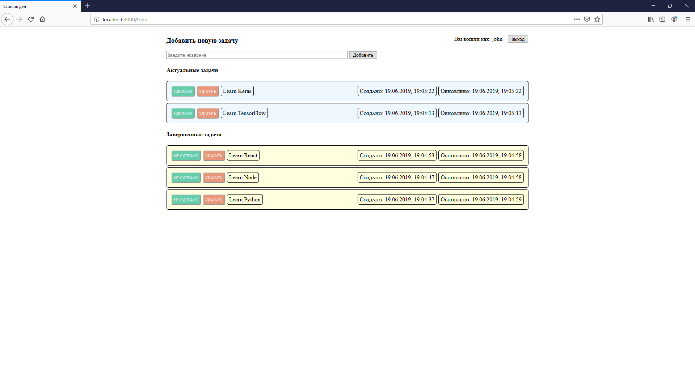

# Authentication

This folder contains "To Do List" express web application that supports authentication implemented in three different ways:

- sessions and cookies
- passport with local strategy
- passport with github strategy

Users and password hashes are stored in Mongo database.

`bcrypt` module is used to handle password validation.

To use Github authentication, valid ClientID and ClientSecret are necessary.

---